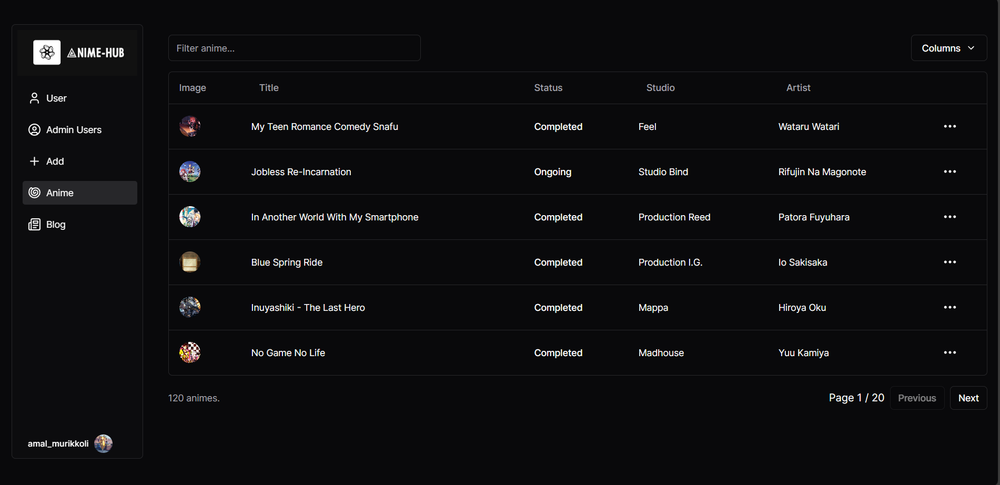

# Anime Hub Admin

Anime Hub admin is an application for admins to manage data related to this anime, like how many users have signed up, managing the roles of the users, adding/updating animes/blogs, etc.

Stack:- 
* I have developed this application using [Next JS](https://nextjs.org) with TypeScript, powered by it's app router.
* I have used [ShadCN UI](https://ui.shadcn.com), an awesome, accessible, highly configurable component library powered by [TailwindCSS](https://tailwindcss.com) for designing this app.
* I have used [Tanstack Query](https://tanstack.com/query/latest) as a data fetching solution, used with [Next JS server actions](https://nextjs.org/docs/app/building-your-application/data-fetching/server-actions-and-mutations) to avoid creating unnecessary API endpoints and redundant API calling, along with that I have used [Zustand](https://zustand-demo.pmnd.rs) for creating global stores for UI states.
* I have used PostgreSQL as my database and [Prisma ORM](https://www.prisma.io) for connecting and querying with my database.
* I have used [Clerk](https://clerk.com) for authentication service.
* I have used [Tip Tap Editor](https://tiptap.dev) for developing my rich text editor from scratch to write my blogs, as it give fine grain customization on how this editor works, as well as the on design this editor.
* Last but not the least, there are few more cool stuff like [Uploadthing](https://uploadthing.com) for image uploading, highly advanced form validation using [Zod](https://zod.dev) and [React Hook Form](https://react-hook-form.com), and some amazing components like date picker, and data table.

Cool features:-
* PWA support
* Data table
* Role based permissions
* Rich Text Editor
* Image Uploading
* Advanced Form Handling

This is an excellent application to show my skills as a frontend engineer with the knowledge of building a fullstack application. I have used a ton of best practises and rules for building a scalable and maintainable application.

Please visit my [application](https://anime-hub-admin.vercel.app), and if you like it, give my repository a star.